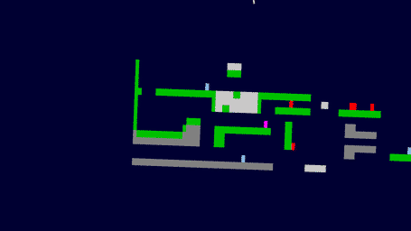

# bruc: A TechWise Summer Project
A multiplayer 2D shooty thing written in Python



## Dependencies
- Python 3.x (That's it)

## Installation
Example with Pacman:
```sh
pacman -S python38
```

## Execution
Running the game client:
```sh
python bruc.py
```

And for the server:
```sh
python brucs.py
```
